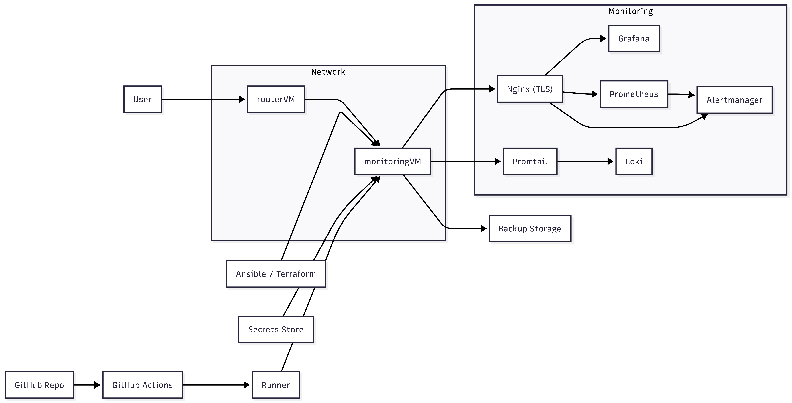

# 🚀 Automated Monitoring Platform (DevOps-ready)

Production-like monitoring stack deployed via Docker, automated with CI/CD, and integrated into a multi-VM network with NAT routing.

---

# 🧠 Overview

This project implements a **centralized monitoring platform** with:

* 📊 Metrics → Prometheus
* 📈 Visualization → Grafana
* 📜 Logs → Loki + Promtail
* 🚨 Alerts → Alertmanager
* 🌐 Reverse proxy → Nginx
* ⚙️ Automation → GitHub Actions + Ansible
* 🌍 Networking → NAT + nftables + jump host

---

# 🏗️ Architecture



### Key Features

- TLS termination via Nginx (HTTPS entrypoint)
- Infrastructure as Code (Ansible / Terraform)
- Centralized secrets management
- Automated backup strategy
- Self-hosted CI/CD (GitHub Actions + Runner)
---  
# 📦 Tech Stack

* Docker / Docker Compose
* Prometheus
* Grafana
* Loki + Promtail
* Alertmanager
* Nginx
* Ansible
* GitHub Actions (CI/CD)
* nftables (NAT + firewall)
  
---

## 🔗 Traffic Flow

### User Traffic  
```
Internet → Bastion → Nginx → Services
```
### Metrics Flow  
```
Prometheus → Node Exporters (VMs)
```
### Logs Flow  
```
Promtail → Loki
```
### Alerts Flow  
```
Prometheus → Alertmanager
```
### CI/CD  
```
GitHub → Actions → Runner → SSH → Docker Deploy
```

---

# 📁 Project Structure

```
monitoring-deploy/
│
├── docker/
│   ├── docker-compose.yml
│   ├── nginx/
│   │   └── nginx.conf
│   ├── prometheus/
│   │   ├── prometheus.yml
│   │   └── alerts.yml
│   ├── alertmanager/
│   │   └── alertmanager.yml
│   ├── promtail/
│   │   └── promtail-config.yaml
│   └── loki/
│       └── local-config.yaml
│
├── ansible/
│   ├── inventory.ini
│   └── playbook.yml
│
├── .github/workflows/
│   └── deploy.yml
│
└── README.md
```

---

# ⚙️ How to Run

## 1. Clone repository

```bash
git clone https://github.com/YOUR_USERNAME/monitoring-deploy.git
cd monitoring-deploy
```

---

## 2. Run locally (for testing)

```bash
cd docker
docker-compose up -d
```

---

## 3. Deploy via CI/CD

Push changes:

```bash
git add .
git commit -m "deploy update"
git push
```

GitHub Actions will:

* SSH into monitoring VM
* Pull latest code
* Restart Docker stack

---

# 🌐 Access

Depending on your setup:

### Via routerVM (NAT):

```
http://<routerVM_IP>:3000 → Grafana
http://<routerVM_IP>:9090 → Prometheus
http://<routerVM_IP>:9093 → Alertmanager
```

### Or via Nginx:

```
http://<routerVM_IP>/grafana/
http://<routerVM_IP>/prometheus/
http://<routerVM_IP>/alertmanager/
```

---

# 🔥 CI/CD Pipeline

GitHub Actions performs:

1. SSH into monitoring VM
2. Pull latest repo
3. Stop old containers
4. Deploy updated stack

---

# ⚠️ Troubleshooting (Real Issues Faced)

## 1. ❌ Port already in use

```
bind: address already in use
```

**Cause:**
Old services (systemd or Docker) still running.

**Fix:**

```bash
docker-compose down
docker rm -f $(docker ps -aq)
```

---

## 2. ❌ Container name conflict

```
container name "/grafana" is already in use
```

**Cause:**
Manual container existed outside docker-compose.

**Fix:**

```bash
docker rm -f grafana
```

---

## 3. ❌ promtail config error

```
config.yaml is a directory
```

**Cause:**
Wrong file name (`.yml` vs `.yaml`)

**Fix:**
Ensure correct file:

```
promtail-config.yaml
```

---

## 4. ❌ No access from host

Everything worked on VM but not from host.

**Cause:**
Broken NAT / firewall rules.

---

## 5. ❌ nftables DNAT not working

**Cause:**
Interface-specific rule:

```
iif "enp1s0"
```

Traffic came from another interface.

**Fix:**
Remove interface restriction:

```bash
dnat without iif
```

---

## 6. ❌ Docker networking broken

```
iptables: No chain DOCKER
```

**Cause:**
nftables restart wiped Docker rules

**Fix:**

```bash
systemctl restart docker
```

---

## 7. ❌ Asymmetric routing

Request reached container but response never returned.

**Cause:**
Missing masquerade for external network.

**Fix:**

```bash
iptables -t nat -A POSTROUTING -s 192.168.100.0/24 -j MASQUERADE
```

---

## 8. ❌ GitHub Actions deploy fails

```
destination path already exists
```

**Fix:**

```bash
rm -rf ~/monitoring
git clone ...
```

---

# 🧠 Key Learnings

* Docker modifies system networking (iptables/nftables)
* NAT requires both DNAT and SNAT
* Interface-specific rules can silently break routing
* Always verify packet flow with tcpdump
* CI/CD must clean previous state

---

# 🚀 Future Improvements

* HTTPS (Let's Encrypt)
* Reverse proxy routing (single domain)
* Alertmanager → Telegram integration
* Multi-node monitoring
* High availability setup

---

# 📌 Author

DevOps / Linux enthusiast focused on automation, infrastructure, and monitoring systems.

